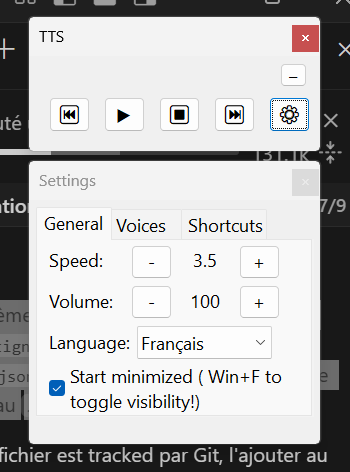

# 🗣️ TTS Reader - Aide en Français

## ⚠️ IMPORTANT : Installer les voix d'abord

**Pour que l'application fonctionne correctement, installez les voix TTS Windows :**

**Paramètres Windows** → "Heure et langue" → "Parole" → Ajouter **Français (France)** et **Anglais (États-Unis)** → Installer chaque voix → Les tester

L'application détecte automatiquement toutes les voix SAPI disponibles sur votre système.

---

## 🚀 Fonctionnement

Double-cliquez sur **tts.exe** pour lancer l'application. Une icône apparaît dans la barre système.

**Clic droit sur l'icône** → Menu avec raccourcis rapides et "Exécuter au démarrage" pour lancer avec Windows

**Utilisation de base :**

- **Sélectionnez du texte** n'importe où (ou copiez-le sans sélection)
- **Win+Y** → Démarre la lecture (et l'arrête aussi)
- Utilisez les **raccourcis** ou l'**interface** pour contrôler la lecture

**Astuce pratique :** La sélection prend toujours priorité sur le presse-papiers. Par exemple, avec un LLM, vous pouvez copier la réponse entière puis sélectionner juste une partie pour ne lire que cette section.

---

## 🎯 Raccourcis essentiels

**Win+Y** → Démarrer/Arrêter la lecture
**Win+F** → Afficher/Masquer l'interface  
**Win+Espace** → Pause/Reprise  
**Win+N** / **Win+P** → Paragraphe suivant/précédent
  
**Pavé numérique :**  
**+** / **-** → Vitesse  
**\*** / **/** → Volume  
**Win+.** → Changer de langue (Auto → Anglais → Français)

*(Tous les raccourcis sont dans l'onglet "Raccourcis" de l'interface)*

---

## ⚙️ Paramètres (bouton ⚙ dans l'interface)

**Onglet Général :**

- **Langue** : Mode Auto (détecte automatiquement Français/Anglais), Anglais fixe ou Français fixe
- **Démarrer réduit** : Démarre sans afficher l'interface (pensez à Win+F pour la réafficher !)

**Onglet Voix :**
Choisissez quelle voix utiliser pour l'anglais et le français. En mode Auto, l'application bascule automatiquement en fonction de la langue détectée dans chaque paragraphe.

**Onglet Raccourcis :**
Liste complète des raccourcis clavier disponibles.

---

## 🎤 Gestion du Microphone

L'application **coupe automatiquement le microphone** pendant la lecture text-to-speech pour éviter les retours audio.

- **Pendant la lecture** : Le microphone est coupé (muet)
- **Pendant la pause** : Le microphone est réactivé
- **Après l'arrêt** : Le microphone est réactivé

Si votre microphone a un nom différent de "Microphone" dans Windows, vous devrez peut-être ajuster le nom du périphérique dans le code source.

---

**C'est tout ! L'interface est intuitive, vous découvrirez le reste en l'utilisant.**
