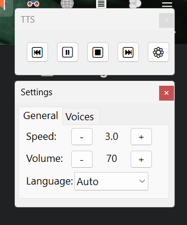

# TTS Reader (Text-to-Speech Reader)

A simple application to read text aloud using text-to-speech voices available on Windows 11.

## Features

- Read selected text or text copied to the clipboard
- Automatic language detection (English or French)
- Control reading speed and volume
- Navigate by paragraph
- Pause and resume reading
- Automatic startup with Windows (optional)
- Control interface with play/pause, stop, forward, and backward buttons
- Quick navigation between paragraphs with rapid clicks

## Installation

1. Download the .exe file from the releases page
2. Double-click the application to launch it
3. On first startup, the application checks for available voices:
   - If all voices are already properly installed, the application starts normally
   - If additional voices are detected but not installed, the application will offer to install them
   - If the application restarts, this is normal - it's installing the missing voices

4. An icon will appear in the system tray, indicating that the application is active

## Usage

1. Select text in any application **OR** use text already copied to the clipboard
   **IMPORTANT:** Selection always takes priority over clipboard content. If you want to use text from the clipboard, make sure no text is selected on screen.
2. Press **Win+Y** to start reading
3. Use the shortcuts below to control playback or use the control interface that appears

### Keyboard Shortcuts

- **Win+Y**: Start/Stop reading
- **Win+Alt+Y**: Pause/Resume reading
- **Win+Ctrl+Y**: Skip to next paragraph
- **Win+Shift+Y**: Go to previous paragraph
- **Numpad+**: Increase speed
- **Numpad-**: Decrease speed
- **Numpad***: Increase volume
- **Numpad/**: Decrease volume

**Note:** You can also view the complete list of shortcuts by right-clicking on the TTS Reader icon in the system tray and selecting "Shortcuts...".

### Control Interface

When reading starts, a control panel appears with:
- ⏮: Go to previous paragraph
- ⏸/▶: Pause/Resume reading
- ⏹: Stop reading
- ⏭: Skip to next paragraph

The control panel can be moved by dragging it and closes automatically when reading stops.

The navigation buttons support rapid clicks for faster navigation:
- First click on ⏮: Go to the beginning of the current paragraph
- Rapid second click on ⏮: Go to the previous paragraph
- Subsequent rapid clicks: Continue moving backward through paragraphs

## Troubleshooting

If the application doesn't work properly after installing voices:

1. Double-click the .exe file again
2. When prompted if you want to replace the existing instance, click "Yes"
3. Test the functionality again with Win+Y

This operation will restart the application and resolve most common issues.

## Automatic Startup with Windows

To set up the application to start automatically with Windows:

1. Right-click on the TTS Reader icon in the system tray
2. Check the "Run at startup" option in the menu

The application will automatically create a shortcut in the Windows startup folder. If a shortcut already exists, it will be updated.

## Supported Languages

The application automatically detects whether the text is in French or English and uses the appropriate voice.

## System Requirements

- Windows 11 or higher
- Microsoft voices installed (the application can install missing voices)

## License

This software is distributed under the MIT license.
