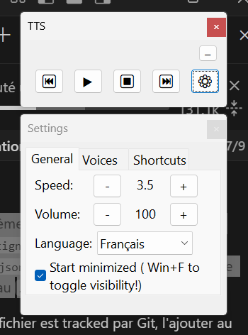

# 🗣️ TTS Reader - Synthèse Vocale

## ⚠️ IMPORTANT : Installez d'abord les voix !

**Pour que ça fonctionne correctement, installez les voix TTS Windows :**

**Paramètres Windows** → "Heure et langue" → "Voix" → Ajoutez **Français (France)** et **Anglais (États-Unis)** → Installez chaque voix → Testez-les

L'application détecte automatiquement toutes les voix SAPI disponibles sur votre système.

---

## 🚀 Comment ça marche

Double-cliquez sur **tts.exe** pour lancer l'application. Une icône apparaît dans la barre système (system tray).

**Clic droit sur l'icône** → Menu avec raccourcis rapides et "Run at startup" pour démarrer avec Windows

**Utilisation de base :**
- **Sélectionnez du texte** n'importe où (ou copiez-le sans sélection)
- **Win+Y** → Lance la lecture (et l'arrête aussi)
- Utilisez les **raccourcis** ou l'**interface** pour contrôler

**Astuce pratique :** La sélection est prioritaire sur le presse-papier. Par exemple, avec un LLM, vous pouvez copier toute la réponse puis sélectionner juste une partie pour ne lire que celle-ci.

---

## 🎯 Les raccourcis essentiels

**Win+Y** → Démarrer/Stopper la lecture
**Win+F** → Afficher/Masquer l'interface
**Win+Espace** → Pause/Reprendre
**Win+N** / **Win+P** → Paragraphe précédent/suivant
  
**Pavé numérique :**
**+** / **-** → Vitesse
**\*** / **/** → Volume
**Win+.** → Changer la langue (Auto → Anglais → Français)

*(Tous les raccourcis sont dans l'onglet "Shortcuts" de l'interface)*

---

## ⚙️ Paramètres (bouton ⚙ dans l'interface)

**Onglet Général :**
- **Langue** : Mode Auto (détecte français/anglais automatiquement), Anglais ou Français fixe
- **Start minimized** : Démarre sans afficher l'interface (pensez à Win+F pour la réafficher !)

**Onglet Voix :**
Choisissez quelle voix utiliser pour l'anglais et pour le français. En mode Auto, l'application bascule automatiquement selon la langue détectée dans chaque paragraphe.

**Onglet Shortcuts :**
Liste complète des raccourcis clavier disponibles.

---

**C'est tout ! L'interface est intuitive, vous découvrirez le reste en l'utilisant.**